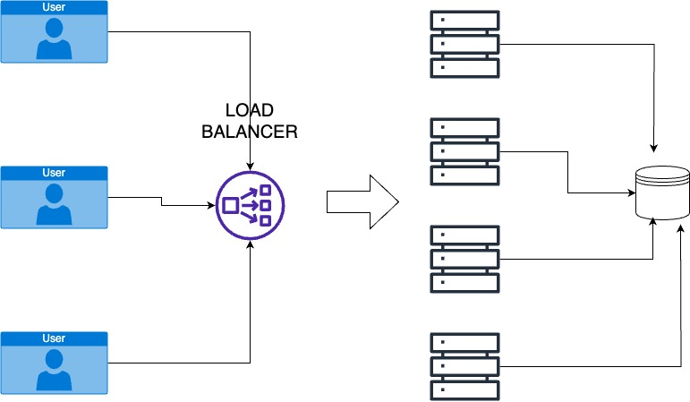
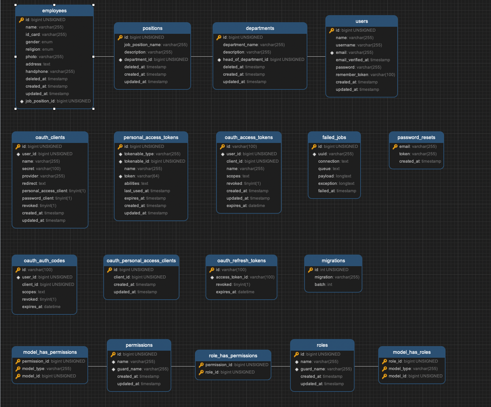
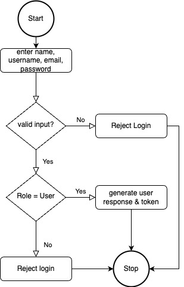
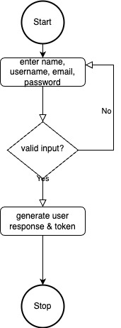

## SEMESTA ENERGY TECHNICAL TEST

#### setup environment
- install docker
- clone project
- run project


### build project
```shell
make build
```
### migrate
after build project done next run this script to migrate the database & seeder, make sure build process is done 

```shell
make migrate
```
### api documentation
to access api documentation visit this link
```
https://documenter.getpostman.com/view/2679695/2s93eePU5b
```
### do unit test
to run unit test
```shell
make test 
```


##### what is concept of load balancer

Load balancing is the process of efficiently distributing network traffic or traffic into a group of servers, also known as a server pool or server farm. Load balancing is useful to ensure that one server of a website that receives a lot of traffic does not experience overload.

Load balancers are used in many types of applications, including web servers, application servers, and database servers. They are critical for maintaining high availability and scalability, as they can quickly and automatically route traffic to healthy servers if any servers fail or become overloaded.

### Visual of load balancer



### ERD



### Flowchart

#### Login


#### Register
